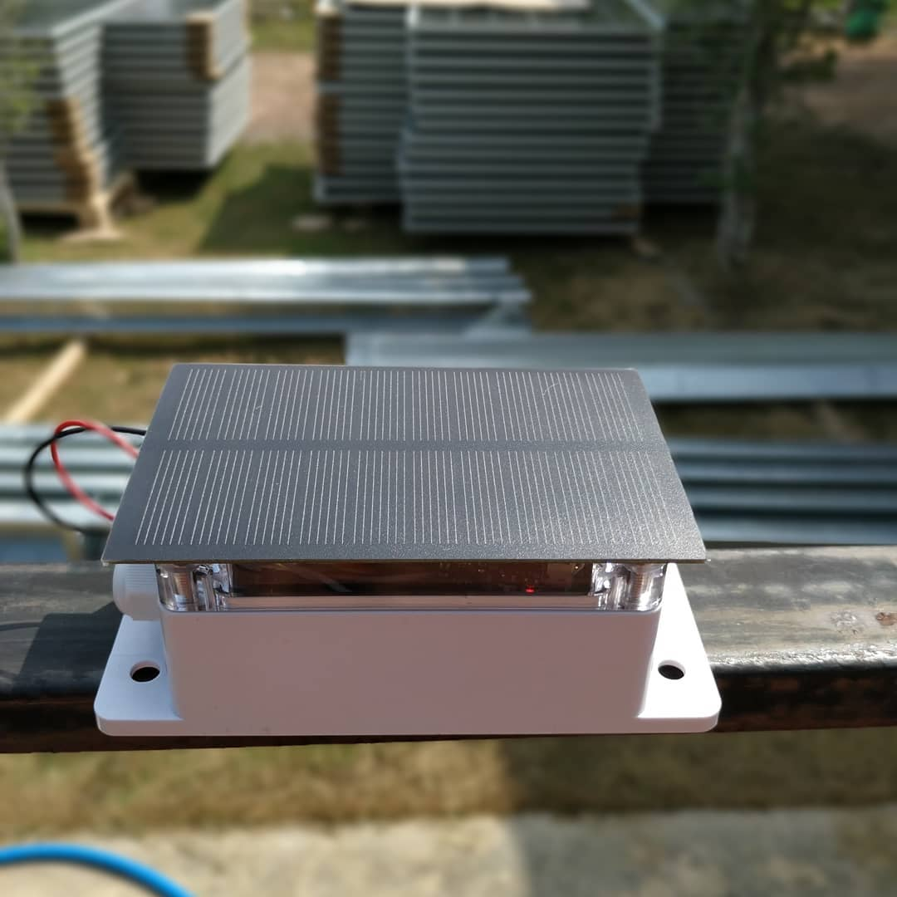

# esp-weather-station

Cheap Weather Station ($10) 
- ESP8266
- BME280 Sensor (Temperature, Humidity, Pressure)
- 18650 Battery

Options
- Solar Panel
- TP4056 1A Micro USB Battery Charger
- SHT21 (Temperature, Humidity)
- DS18B20 (Temperature)

Example: https://tonofarm.herokuapp.com/

See more information in my blog ..
https://ton.packetlove.com/blog/

Source: https://RandomNerdTutorials.com/cloud-weather-station-esp32-esp8266/